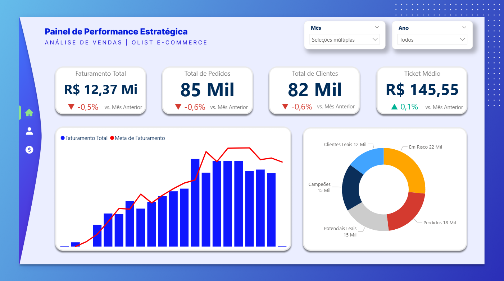
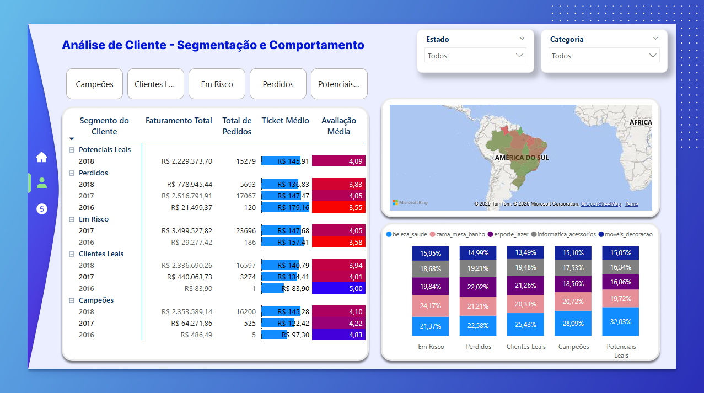
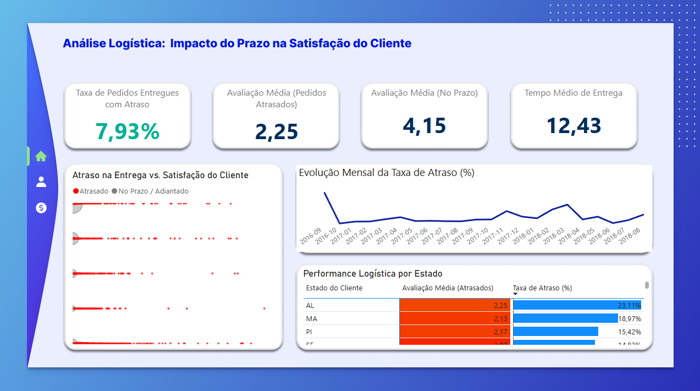

# Análise de Vendas e Clientes da Olist


## 📖 Visão Geral do Projeto

A Olist, a maior loja de departamentos do Brasil, enfrentava um desafio crítico de retenção de clientes, com um alto custo de aquisição que não se traduzia em lealdade.

Este projeto realiza um **diagnóstico completo deste problema**, utilizando um pipeline de dados ponta a ponta. A análise, desenvolvida em Python, identificou que a **principal causa do churn era a inconsistência na operação logística**.

O resultado final é um painel estratégico em Power BI que não só prova esta hipótese de forma visual e interativa, mas também segmenta os clientes, identifica as regiões mais críticas e fornece uma ferramenta acionável para a tomada de decisões estratégicas.

## 🖼️ Visão Geral dos Painéis

**Painel 1: Performance Estratégica**


Uma visão executiva dos principais KPIs de negócio, com análise de performance mensal.


**Painel 2: Análise de Clientes**


Segmentação de clientes utilizando o modelo RFM para identificar comportamentos e analisar a distribuição geográfica da base de clientes.


**Painel 3: Diagnóstico Logístico**



A análise aprofundada que comprova a correlação direta entre atrasos na entrega e a queda na satisfação do cliente, identificando também as regiões mais problemáticas.


---
## 🗃️ Estrutura do Projeto

O trabalho foi dividido em dois notebooks distintos para garantir a modularidade e as boas práticas de um projeto de dados:

1. `01_ETL_Olist.ipynb`: Responsável pela **Extração, Transformação e Carga (ETL)**. Este notebook lida com a leitura de 10 datasets brutos, limpeza, tratamento de valores nulos e anomalias, e a consolidação de todas as fontes num dataset analítico limpo.

2. `02_Analise_e_Exportacao.ipynb`: Focado na **Análise de Negócio e Engenharia de Dados para BI**. A partir do dataset limpo, este notebook desenvolve:
   
   - Análise de comportamento do cliente com o modelo **RFM (Recência, Frequência, Valor Monetário)**.

   - Análise logística para investigar a correlação entre o tempo de entrega e a satisfação do cliente.

   - Criação e exportação das tabelas Fato e Dimensão que compõem o **Modelo Star Schema** para o Power BI.

---

## 🛠️ Business Intelligence (Power BI)

A camada de visualização foi construída para ser uma ferramenta de análise estratégica, com os seguintes destaques técnicos:

- **Modelagem:** Implementação de um Modelo de Dados Star Schema com relacionamentos otimizados para performance.

- **DAX:**

  - Criação de uma **dimensão de calendário** `(dCalendario)` para análises de Time Intelligence.

  - Desenvolvimento de **medidas complexas** para KPIs de negócio, como variações MoM (Mês a Mês) e métricas de satisfação condicional.

- **UI/UX:**

  - Aplicação de um **layout de fundo profissional** criado no Figma para garantir uma identidade visual única e uma experiência de utilizador intuitiva.

  - Uso de **formatação condicional e técnicas de storytelling** para guiar o utilizador através dos insights.

- **Painéis:** O dashboard é composto por 3 páginas interativas: (1) Painel de Performance Estratégica, (2) Análise de Clientes e (3) Diagnóstico Logístico.

## 💡Principais Insights Descobertos

A análise revelou uma forte correlação entre a experiência de entrega e a lealdade do cliente:

1. O Custo do Atraso: A análise comprovou que a **nota média de avaliação de um cliente cai de 4.15 (excelente) para 2.25 (péssimo)** quando um pedido sofre qualquer tipo de atraso.

2. **O "Balde Furado":** A base de clientes da Olist está dividida quase ao meio, com **48% de clientes em segmentos problemáticos ("Em Risco" e "Perdidos")**, evidenciando uma falha grave na retenção.

3. **A Causa Raiz do Churn:** A inconsistência na operação logística foi validada como a causa mais provável para a alta taxa de churn. Uma única experiência de entrega ruim é suficiente para mover um cliente para um segmento de risco.

## 💻 Ferramentas Utilizadas

- **Linguagem:** Python
- **Bibliotecas Principais:**`pandas` `matplotlib`, `seaborn`.
- **BI:** Power BI Desktop
- **Design:** Figma

---

## 🚀 Como Executar o Projeto

1.  **Clone o repositório:**
    ```bash
    git clone https://github.com/mtferreira13/projeto-olist-dataset
    ```

2. **Estrutura de Pastas:** Certifique-se de que os dados brutos da Olist estejam na pasta `data/unprocessed/`.

3. **Execute o ETL:** Rode o notebook `01_ETL_Olist.ipynb` para gerar os dados processados na pasta `data/processed/`.

4. **Execute a Análise:** Rode o notebook `02_Analise_e_Exportacao.ipynb` para gerar as tabelas do modelo de dados na pasta `data/model/`.

5. **Abra no Power BI:**  Carregue os três arquivos CSV da pasta `data/model/` para o Power BI e construa os relacionamentos do modelo.
---


